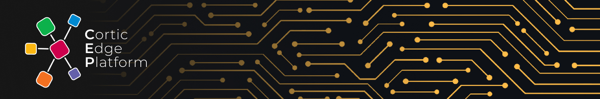

CEP is a software platform designed for users that want to learn or rapidly prototype using standard A.I. components. It runs on the popular [Raspberry Pi 4B and 400](https://www.raspberrypi.org/products/) single-board computer and has native support for the Luxonis [OAK-D](https://shop.luxonis.com/products/1098obcenclosure) and [OAK-D-Lite](https://www.kickstarter.com/projects/opencv/opencv-ai-kit-oak-depth-camera-4k-cv-edge-object-detection) stereo cameras. It comprises two sub-components: CAIT (the Cortic A.I. Toolkit) and CURT (the Cortic Universal RunTime).


CAIT is a visual programming interface (based on Microsoft's [MakeCode](https://github.com/microsoft/pxt) project) and a low-code Python API. Users with no prior programming experience can use the visual programming interface to create their own A.I. projects and deploy them to run on the OAK-D camera. More experienced users can use the low-code API to quickly create A.I. programs using Python.

CURT is a middleware system that enables users to distribute A.I. computations to different computing devices on the local network. CURT's decentralized mesh architecture automatically handles device failover and load balancing for the user. It also offers a simple command-based programming interface. Developers can implement complex workflows using easy-to-understand sequential commands while the system manages the scheduling of the underlying asynchronous tasks. 

CURT allows the deployment of docker-based container modules. We currently include five built-in modules:
1. Computer vision (deep learning vision models that run on either RPi or OAK-D)
2. Voice (on device and cloud-based speech recognition and speech generation)
3. NLP (customizable natural language processing tools)
4. Control (LEGO motor control)
5. Smart home (control smart home devices via HomeAssistant)

Each module can advertise a set of services on the network. In addition, each service can host a group of workers that perform various tasks. Please refer to our sample codes on configuring modules, services, and workers on supported devices. They also illustrate the use of the command-based programming interface.

## Hardware Configuration

CEP currently supports the following hardware configuration.   

* Any of Raspberry Pi 4B 2GB/4Gb/8GB or 400 models
* Micro SD card (we recommend at least 32GB)
* OAK-D camera
* ReSpeaker 4-Mic Array for Raspberry Pi
* Mini speaker with 3.5mm audio jack
* Any Raspberry Pi compatible battery HAT
* LEGO Mindstorms Robot Inventor Kit
* Lights and speakers supported by HomeAssistant

## Installation

Before you start, make sure there is at least 32GB of free space on your SD card. Then, open a terminal in RaspberryPi OS and type the following commands.

```
$ git clone https://github.com/cortictechnology/cep
$ cd cep
$ bash setup.sh
```
The Raspberry Pi device will reboot at the end of the setup script.

An additional installation step is required to support the ReSpeaker 4-Mic array. Enter the following commands into the terminal.

```
$ git clone https://github.com/respeaker/seeed-voicecard
$ cd seeed-voicecard
$ sudo ./install.sh
$ sudo reboot
```
Your device will reboot again after installing the Re-Speaker device driver.

## Visual Programming 

1. Make sure your Raspberry Pi device is connected to the local WiFi.
2. On a computer connected to the same WiFi, go to ``http://<raspberry_pi_hostname>.local/setup`` on your browser and follow the instruction to complete the setup process. The Raspberry Pi device will reboot itself.
3. After the setup process completes, you can access the visual programming interface at ``http://<raspberry_pi_hostname>.local/programming``. 
4. You can use the link at the bottom of the login page to create a new local account or use the default ```pi``` account to sign in.

You can click on the ``Load`` icon to open any sample project with the ``.cait`` extension in the ``examples`` folder.

## Python Programming

We recommend using the VSCode editor for Python development. You can enter the following commands on the command line to install it.

```
sudo apt update 
sudo apt install code -y
```

Please refer to the Python sample codes included in the ``examples`` folder to get started using CAIT's low-code API and CURT's command-based API.

## How to contribute

We welcome contributions from all our users. You can contribute by requesting features or reporting bugs under "Issues."  You can also submit proposed code updates through pull requests to our "dev" branch.

## Follow us on social media

If you are interested in upcoming features and applications of CEP, please follow us on [Twitter](https://twitter.com/CorticTechnolo1) or [LinkedIn](https://www.linkedin.com/company/cortic/).
